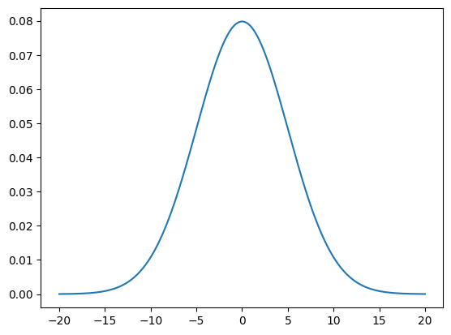

# Quick Reference Table

| name              | values     | bounds      | parameters                                                                                 | models                                                                                                                        | preview                                                                   |
| ----------------- | ---------- | ----------- | ------------------------------------------------------------------------------------------ | ----------------------------------------------------------------------------------------------------------------------------- | ------------------------------------------------------------------------- |
| bernoulli         | discrete   | [0, 1]      | p = probability of "success" outcome [0, 1]                                                | binary outcome on single trial                                                                                                |                         |
| beta              | continuous | [0, 1]      | α = n_successes+1 or shape 1, β = n_trials-α or shape 2                                    | random variables between 0 and 1, probabilities & proportions                                                                 |                                        |
| binomial          | discrete   | {1...n}     | p = probability of "success" outcome per trial [0, 1], n = number of trials {1...n}        | outcomes of multiple bernoulli trials                                                                                         |                            |
| cauchy            | continuous | (-inf, inf) | x0 = center of distribution, γ = scale (0, )                                               | ratio between two independent, normal random variables with μ = 0                                                             |                                  |
| uniform           | discrete   | {a...b}     | a = lower bound, b = upper bound                                                           | outcomes take limited integer values and are equally likely                                                                   |            |
| uniform           | continuous | [a, b]      | a = lower bound, b = upper bound                                                           | outcomes take any value in range and are equally likely                                                                       |        |
| exponential       | continuous | [0, inf)    | λ = rate of events in poisson process                                                      | time between poisson distributed events                                                                                       |                   |
| gamma             | continuous | (0, inf)    | α = shape, β = rate                                                                        | time between events ocurring at a constant average rate                                                                       |                                     |
| gaussian          | continuous | (-inf, inf) | μ = center of distribution, σ = standard deviation                                         | normally distributed random variables                                                                                         |                            |
| geometric         | discrete   | {0...inf}   | p = probability of "success" outcome per trial [0, 1]                                      | number of trials before 1 success                                                                                             |                         |
| hypergeometric    | discrete   | {0...n}     | p = probability of "success" outcome per trial [0, 1], n = number of trials {1...n}        | successful outcomes from n trials                                                                                             |          |
| laplace           | continuous | (-inf, inf) | μ = center of distribution, b = scale (0, )                                                | difference between two independent exponential random variables with equal distributions                                      |                               |
| logistic          | continuous | (-inf, inf) | μ = center of distribution, s = scale (0, )                                                | log odds of randomly chosen probabilty in range [0, 1]                                                                        |                            |
| lognormal         | continuous | [0, inf)    | μ = center of distribution for random variable, σ = standard deviation for random variable | random variable with normally distributed ln                                                                                  |                         |
| negative binomial | discrete   | {0...inf}   | p = probability of "success" outcome per trial [0, 1], r = number of successes {1...n}     | number of failures before r successes                                                                                         |  |
| pareto            | continuous | (x0, inf)   | x0 = minimum x value (0, inf), α = shape (0, inf)                                          | power law related variables                                                                                                   |                                  |
| poisson           | discrete   | (0, inf)    | λ = rate of events in given interval                                                       | number of events occurring in a fixed interval where events have a known average but variable occurence in the given interval |                               |
| student t         | continuous | (-inf, inf) | ν = degrees of freedom {1, inf}                                                            | generalized normal distribution with heavier tails                                                                            |                             |
| inverse gamma     | continuous | (0, inf)    | α = shape, β = scale                                                                       | reciprocal of gamma distributed random variable                                                                               |              |
| beta binomial     | discrete   | {1...n}     | n = number of trials, α = shape 1, β = shape 2                                             | binomial distribution for n trials where p is drawn from a beta(a, b) distribution                                            |              |
